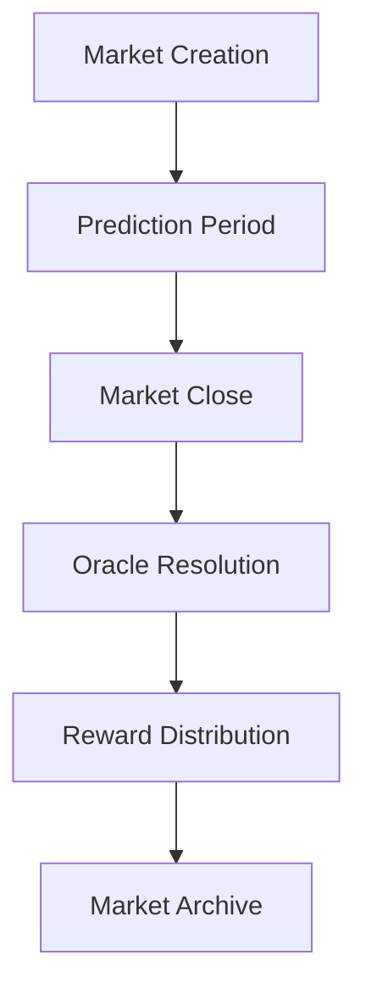

# BitOracle 🔮

> A next-generation decentralized Bitcoin price prediction protocol built on Stacks L2

[](https://stacks.co)
[](https://clarity-lang.org)
[](LICENSE)
[](package.json)

## Overview

BitOracle transforms Bitcoin price speculation into a structured, decentralized prediction ecosystem. Built on Stacks' unique Bitcoin-anchored architecture, the protocol enables participants to stake STX tokens on directional Bitcoin price movements, creating liquid prediction markets with cryptographic settlement guarantees.

### Key Features

- 🔒 **Bitcoin-native settlement** through Stacks L2 infrastructure
- 🛡️ **Trustless oracle integration** with multi-signature validation
- ⚖️ **Dynamic stake-weighted rewards** for accurate predictions
- 🚫 **Anti-manipulation safeguards** through economic incentives
- ⚡ **Gas-efficient operations** leveraging L2 scaling benefits

## Architecture

### Core Components

1. **Prediction Markets**: Time-bounded markets with defined open/close periods
2. **Oracle System**: Authorized price feed resolution mechanism
3. **Staking Engine**: STX token escrow and reward distribution
4. **Incentive Layer**: Proportional rewards based on stake size and accuracy

### Market Lifecycle



## Smart Contract Interface

### Core Functions

#### Market Management

```clarity
;; Create a new prediction market
(create-prediction-market 
  (btc-price uint) 
  (open-height uint) 
  (close-height uint)
) -> (response uint uint)

;; Submit price prediction
(predict-price-movement 
  (market-id uint) 
  (direction (string-ascii 4)) 
  (stake-amount uint)
) -> (response bool uint)

;; Resolve market with final price
(resolve-market 
  (market-id uint) 
  (btc-final-price uint)
) -> (response bool uint)

;; Claim prediction rewards
(claim-rewards (market-id uint)) -> (response uint uint)
```

#### Read-Only Queries

```clarity
;; Get market information
(get-market-details (market-id uint)) -> (optional market-data)

;; Get participant position
(get-participant-position 
  (market-id uint) 
  (participant principal)
) -> (optional position-data)

;; Get platform configuration
(get-platform-config) -> config-data
```

### Data Structures

#### Market Configuration

```clarity
{
  btc-start-price: uint,
  btc-end-price: uint,
  total-up-stakes: uint,
  total-down-stakes: uint,
  market-open-height: uint,
  market-close-height: uint,
  is-resolved: bool,
  created-at: uint
}
```

#### Participant Position

```clarity
{
  direction: (string-ascii 4),
  stake-amount: uint,
  rewards-claimed: bool,
  position-timestamp: uint
}
```

## Getting Started

### Prerequisites

- [Clarinet](https://github.com/hirosystems/clarinet) >= 2.0
- [Node.js](https://nodejs.org/) >= 18
- [Stacks Wallet](https://wallet.hiro.so/) for testnet interaction

### Installation

1. **Clone the repository**

   ```bash
   git clone https://github.com/donald-oputims/BitOracle.git
   cd BitOracle
   ```

2. **Install dependencies**

   ```bash
   npm install
   ```

3. **Verify contract syntax**

   ```bash
   clarinet check
   ```

4. **Run tests**

   ```bash
   npm test
   ```

### Local Development

#### Start Clarinet Console

```bash
clarinet console
```

#### Deploy to Devnet

```bash
clarinet integrate
```

#### Run Test Suite

```bash
npm run test:watch  # Watch mode
npm run test:report # With coverage
```

## Usage Examples

### Creating a Prediction Market

```clarity
;; Create market for Bitcoin at $45,000
;; Open at block 1000, close at block 2000
(contract-call? .BitOracle create-prediction-market 
  u45000000000  ;; $45,000 in micro-units
  u1000         ;; Open block height
  u2000         ;; Close block height
)
```

### Placing a Prediction

```clarity
;; Predict Bitcoin will go UP with 10 STX stake
(contract-call? .BitOracle predict-price-movement 
  u1            ;; Market ID
  "up"          ;; Direction
  u10000000     ;; 10 STX in micro-STX
)
```

### Claiming Rewards

```clarity
;; Claim rewards after market resolution
(contract-call? .BitOracle claim-rewards u1)
```

## Economic Model

### Stake Requirements

- **Minimum Stake**: 1 STX (1,000,000 micro-STX)
- **Platform Fee**: 2% (200 basis points)
- **Fee Cap**: Maximum 10% platform fee

### Reward Calculation

Winners share the total market pool proportionally:

```math
Individual Payout = (Individual Stake / Total Winning Stakes) × Total Market Pool × (1 - Platform Fee)
```

### Example Scenario

**Market Setup:**

- Bitcoin starts at $45,000
- Total UP stakes: 100 STX
- Total DOWN stakes: 200 STX
- Final price: $47,000 (UP wins)

**Payout for 10 STX UP stake:**

```math
Payout = (10 / 100) × 300 × 0.98 = 29.4 STX
```

## Testing

The project uses Vitest with Clarinet SDK for comprehensive testing:

```bash
# Run all tests
npm test

# Run tests with coverage
npm run test:report

# Watch mode for development
npm run test:watch
```

### Test Categories

- ✅ **Unit Tests**: Individual function validation
- ✅ **Integration Tests**: End-to-end market workflows
- ✅ **Edge Cases**: Error handling and boundary conditions
- ✅ **Gas Optimization**: Transaction cost analysis

## Deployment

### Testnet Deployment

1. **Configure Stacks CLI**

   ```bash
   stx auth -t
   ```

2. **Deploy Contract**

   ```bash
   clarinet deployments apply --deployment testnet
   ```

3. **Verify Deployment**

   ```bash
   clarinet deployments describe --deployment testnet
   ```

### Mainnet Deployment

> ⚠️ **Warning**: Mainnet deployment requires careful security auditing and testing.

```bash
# Production deployment
clarinet deployments apply --deployment mainnet
```

## Security Considerations

### Smart Contract Security

- ✅ **Overflow Protection**: All arithmetic operations use safe math
- ✅ **Access Control**: Role-based function restrictions
- ✅ **Reentrancy Guards**: State updates before external calls
- ✅ **Input Validation**: Comprehensive parameter checking

### Oracle Security

- 🔐 **Authorized Resolution**: Only designated oracle can resolve markets
- 🕐 **Time Constraints**: Markets can only be resolved after close time
- 📊 **Price Validation**: Non-zero price requirements

### Economic Security

- 💰 **Minimum Stakes**: Prevents spam predictions
- 🎯 **Proportional Rewards**: Incentivizes larger, confident stakes
- 🚫 **Fee Caps**: Protects users from excessive platform fees

## Roadmap

### Phase 1: Core Protocol ✅

- [x] Basic prediction markets
- [x] Oracle integration
- [x] Reward distribution
- [x] Administrative functions

### Phase 2: Enhanced Features 🚧

- [ ] Multi-timeframe markets
- [ ] Automated market makers
- [ ] Governance token integration
- [ ] Advanced oracle aggregation

### Phase 3: Ecosystem Expansion 📋

- [ ] Mobile application
- [ ] Analytics dashboard
- [ ] API for external integrations
- [ ] Cross-chain bridge support

## Contributing

We welcome contributions! Please see our [Contributing Guidelines](CONTRIBUTING.md) for details.

### Development Workflow

1. Fork the repository
2. Create a feature branch
3. Write tests for new functionality
4. Ensure all tests pass
5. Submit a pull request

### Code Standards

- Follow [Clarity style guide](https://book.clarity-lang.org/ch02-06-clarity-style-guide.html)
- Add comprehensive test coverage
- Document public functions
- Use meaningful variable names

## API Reference

### Error Codes

| Code | Constant | Description |
|------|----------|-------------|
| 100 | `ERR_UNAUTHORIZED` | Caller lacks required permissions |
| 101 | `ERR_MARKET_NOT_FOUND` | Market ID does not exist |
| 102 | `ERR_INVALID_PREDICTION` | Invalid prediction direction |
| 103 | `ERR_MARKET_INACTIVE` | Market is closed or not yet open |
| 104 | `ERR_ALREADY_CLAIMED` | Rewards already claimed |
| 105 | `ERR_INSUFFICIENT_FUNDS` | Insufficient STX balance |
| 106 | `ERR_INVALID_PARAMS` | Invalid function parameters |
| 107 | `ERR_MARKET_UNRESOLVED` | Market not yet resolved |

### Configuration Parameters

| Parameter | Default | Description |
|-----------|---------|-------------|
| `min-stake-amount` | 1 STX | Minimum prediction stake |
| `platform-fee-basis-points` | 200 (2%) | Platform fee percentage |
| `oracle-principal` | Set by owner | Authorized oracle address |

## License

This project is licensed under the MIT License - see the [LICENSE](LICENSE) file for details.
